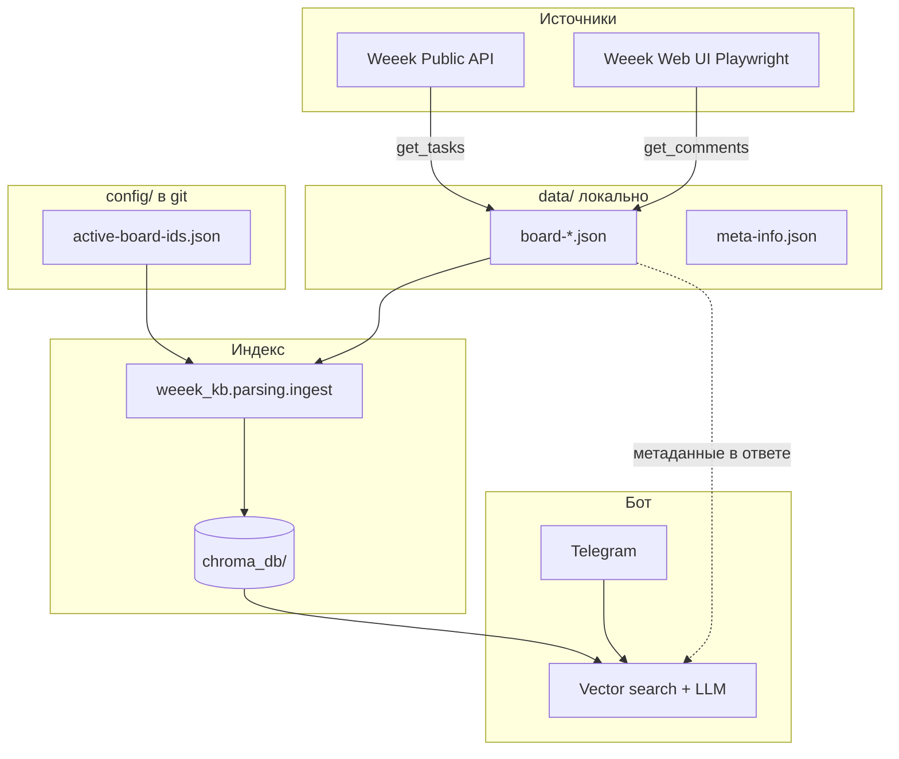

# Weeek base helper

Telegram-бот с RAG-поиском по задачам [Weeek](https://weeek.net): локальные JSON-экспорты досок → векторный индекс (ChromaDB + OpenAI embeddings) → ответы из описаний и комментариев. Отдельно — постановка новых задач в Weeek через Public API.

Проект рассчитан на **несколько досок (сайтов/клиентов)**: у каждой доски локальный файл `data/board-*.json` и своя коллекция в Chroma. Каталог `data/` **не хранится в git**; список досок — в `config/active-board-ids.json`.

---

## Содержание

- [Архитектура](#архитектура)
- [Требования](#требования)
- [Установка](#установка)
- [Конфигурация (.env)](#конфигурация-env)
- [Каталог data/](#каталог-data)
- [Типовой цикл обновления](#типовой-цикл-обновления)
- [Скрипты синхронизации](#скрипты-синхронизации)
- [Индексация Chroma (ingest)](#индексация-chroma-ingest)
- [Telegram-бот](#telegram-бот)
- [Безопасность и учётные данные](#безопасность-и-учётные-данные)
- [Структура репозитория](#структура-репозитория)
- [Тесты](#тесты)
- [Деплой (systemd)](#деплой-systemd)
- [Устранение неполадок](#устранение-неполадок)

---

## Архитектура



**Поток данных:**

1. **`get_tasks`** — новые/изменённые задачи с API → дописывает в `board-*.json`, обновляет `meta-info.json`.
2. **`get_comments`** — комментарии с карточек в браузере (API их не отдаёт) → merge в `comments[]` в тех же JSON.
3. **`ingest`** — строит/обновляет эмбеддинги в Chroma (по умолчанию **инкрементально**).
4. **`bot`** — вопросы пользователя: гибридный поиск + LLM-сводка; постановка задач — отдельный сценарий через API.

---

## Требования

- Python **3.10+**
- Ключи: **OpenAI** (chat, embeddings, опционально Whisper), **Telegram Bot**, **Weeek API**
- Для комментариев: **Playwright** + Chromium (`playwright install chromium`)
- Диск: место под `chroma_db/` (зависит от числа задач; десятки МБ — ГБ)

---

## Установка

```bash
cd /path/to/weeek_helper
python -m venv .venv

# Windows
.venv\Scripts\activate

# Linux/macOS
source .venv/bin/activate

pip install -r requirements.txt
playwright install chromium
mkdir data
copy config\meta-info.json.example data\meta-info.json
```

Создайте `.env` в корне (см. [ниже](#конфигурация-env)). Файл в `.gitignore`, в репозиторий не коммитить. Каталог `data/` тоже не в git — появится после `get_tasks` или копирования с другой машины.

Первый полный индекс после настройки:

```bash
python -m weeek_kb.parsing.ingest --reset
python -m weeek_kb.bot
```

---

## Конфигурация (.env)

| Переменная | Назначение | По умолчанию |
|------------|------------|--------------|
| `TELEGRAM_BOT_TOKEN` | Токен бота | — |
| `OPENAI_API_KEY` | OpenAI API | — |
| `WEEEK_API_TOKEN` | Weeek Public API | — |
| `WEEEK_WORKSPACE_ID` | ID workspace в URL задач | `423726` |
| `WEEEK_EMAIL` / `WEEEK_LOGIN` | Логин для Playwright | — |
| `WEEEK_PASSWORD` | Пароль для Playwright | — |
| `OPENAI_CHAT_MODEL` | Модель ответов / intent | `gpt-4o-mini` |
| `OPENAI_EMBED_MODEL` | Модель эмбеддингов | `text-embedding-3-small` |
| `OPENAI_TRANSCRIBE_MODEL` | Голосовые сообщения | `whisper-1` |
| `VECTOR_SEARCH_PER_QUERY` | Hits на один подзапрос | `15` |
| `TOP_K_AFTER_MERGE` | Кандидатов после merge | `10` |
| `INTENT_CONFIDENCE_THRESHOLD` | Порог question vs task | `0.65` |
| `TASK_DEFAULT_COLUMN_NAME` | Колонка новых задач | `На неделю` |
| `TASK_DEFAULT_REQUESTER` | Заявитель по умолчанию | `Мария` |
| `WEEEK_SESSION_FILE` | Файл сессии Playwright | `data/weeek-playwright-session.json` |

Допускаются опечатки в имени ключа OpenAI: `OPEN_APY_KEY`, `OPENAI_APY_KEY`.

---

## Каталог data/ (локально, не в git)

Папка `data/` в `.gitignore`. Создайте её на сервере и заполните скриптами `get_tasks` / `get_comments` или скопируйте с рабочей машины.

| Файл / маска | Описание |
|--------------|----------|
| `board-{id}-{slug}.json` | Задачи одной доски Weeek (`meta` + массив `задачи`) |
| `meta-info.json` | `last_id`, `last_date` — якорь для API и фильтра комментариев (шаблон: [`config/meta-info.json.example`](config/meta-info.json.example)) |
| `weeek-playwright-session.json` | Cookies сессии браузера |
| `.web-comments-progress/*.jsonl` | Опциональный sidecar прогресса комментариев |

### config/ (в репозитории)

| Файл | Описание |
|------|----------|
| [`active-board-ids.json`](config/active-board-ids.json) | Список **boardId** для ingest, бота, `get_tasks`, `get_comments` |
| `meta-info.json.example` | Пример `meta-info.json` для копирования в `data/` |

### Формат `board-*.json`

```json
{
  "meta": {
    "projectId": 13,
    "boardId": 55,
    "метка": "filinteriors.ru"
  },
  "задачи": [
    {
      "id": 14818,
      "название": "...",
      "описание": "текст или HTML",
      "статус": "Активна",
      "колонка": "На неделю",
      "датаСоздания": "2026-04-13T13:42:51Z",
      "датаЗавершения": null,
      "comments": [
        { "автор": "...", "дата": "...", "комментарий": "..." }
      ],
      "commentsFetchedAt": "2026-05-17T10:00:00Z"
    }
  ]
}
```

### Активные доски

[`config/active-board-ids.json`](config/active-board-ids.json):

```json
{
  "boardIds": [6, 24, 25, 55, 10, 8, 56]
}
```

Обрабатываются только файлы `board-*.json`, у которых `meta.boardId` входит в этот список. Остальные JSON в `data/` (например `meta-info.json`) **не индексируются**.

Соответствие ID и файлов (текущее):

| boardId | Файл |
|--------:|------|
| 6 | `board-6-avrora-kanc-rf.json` |
| 8 | `board-8-akord-kazan-ru.json` |
| 10 | `board-10-avrorastore-ru.json` |
| 24 | `board-24-makukhinmoscow-com.json` |
| 25 | `board-25-textileavenue-ru.json` |
| 55 | `board-55-filinteriors-ru.json` |
| 56 | `board-56-giftec-reflection-ru.json` |

---

## Типовой цикл обновления

Рекомендуемый порядок на сервере или локально:

```bash
# 1. Новые задачи из API
python -m weeek_kb.parsing.get_tasks

# 2. Комментарии из веб-UI (долго; на VPS — headless + session)
python -m weeek_kb.parsing.get_comments --headless --resume

# 3. Обновить векторный индекс (инкремент)
python -m weeek_kb.parsing.ingest

# 4. Бот (отдельный процесс)
python -m weeek_kb.bot
```

После `get_tasks` и `get_comments` автоматически удаляются файлы `data/*.bak` (если остались).

---

## Скрипты синхронизации

### `python -m weeek_kb.parsing.get_tasks`

Загружает из Weeek Public API задачи с `id > meta-info.last_id` и мержит в нужный `board-*.json` по `boardId`.

- Для **пустых** досок (нет задач в JSON) — полная догрузка всех задач доски.
- Описания очищаются от HTML при записи (`html_utils.sanitize_task_record`).
- В конце обновляет `meta-info.json` (`last_id`, `last_date`).

```bash
python -m weeek_kb.parsing.get_tasks
python -m weeek_kb.parsing.get_tasks --dry-run
python -m weeek_kb.parsing.get_tasks --data-dir ./data
```

### `python -m weeek_kb.parsing.get_comments`

Сбор комментариев через **Playwright** (в API их нет). Пишет сразу в `board-*.json`.

**Фильтр задач:**

- Активные колонки: «Бэклог (следующий спринт)», «Требуется дополнение», «На неделю», «Контроль качества».
- Завершённые: колонка «Сделано» или статус «Завершена», если `датаЗавершения` попадает в **7 дней** от `meta-info.last_date`.

**Merge комментариев:** все с карточки; дедуп по паре `(дата, текст)` с уже сохранёнными «свежими» комментариями.

```bash
# Полный прогон (интерактивный браузер)
python -m weeek_kb.parsing.get_comments

# Сервер
python -m weeek_kb.parsing.get_comments --headless --resume

# Одна доска / лимит / тест
python -m weeek_kb.parsing.get_comments --files board-8-akord-kazan-ru.json --limit-tasks 5
python -m weeek_kb.parsing.get_comments --dry-run

# Первый вход или протухшая сессия
python -m weeek_kb.parsing.get_comments --manual-login

# Перенос из sidecar без браузера
python -m weeek_kb.parsing.get_comments --apply-sidecar
```

Полезные флаги: `--only-task-id`, `--force-refresh`, `--replace-comments`, `--progress-sidecar`, `--cookie-file`.

### `python -m weeek_kb.parsing.clean_board_json`

Разовая очистка HTML в полях `описание` и `комментарий` во всех `board-*.json` (без браузера и API).

```bash
python -m weeek_kb.parsing.clean_board_json
python -m weeek_kb.parsing.clean_board_json --dry-run
```

---

## Индексация Chroma (ingest)

Модуль: `weeek_kb/parsing/ingest.py`. Клиент и эмбеддинги: `weeek_kb/search/vector_store.py` (OpenAI через Chroma).

**Документ для эмбеддинга** = название + описание (без HTML) + все комментарии + метка проекта. Длинные задачи режутся на чанки ≤ 8000 токенов.

**ID чанка:** `task:{task_id}:{chunk_index}` (схема `chunk_id_version=v2` в metadata).

**Инкремент (по умолчанию):** сравнение `content_hash` (SHA256 нормализованного текста). Неизменённые чанки → `skip`, без повторного вызова embeddings API.

```bash
# Инкремент всех активных досок
python -m weeek_kb.parsing.ingest

# Одна доска
python -m weeek_kb.parsing.ingest --only board-8-akord-kazan-ru

# План без записи
python -m weeek_kb.parsing.ingest --dry-run

# Полный реиндекс (drop коллекции)
python -m weeek_kb.parsing.ingest --reset
```

Пример вывода:

```
board-8-akord-kazan-ru.json -> collection=board-8-akord-kazan-ru  add=3 update=1 delete=0 skip=116
Done. add=3 update=1 delete=0 skip=116
```

### Когда нужен `--reset`

- Первый запуск после смены схемы ID чанков.
- Смена `OPENAI_EMBED_MODEL`.
- Изменение логики чанкования.
- Повреждённая или рассинхронизированная `chroma_db/`.

Полное удаление индекса вручную:

```powershell
# Windows
Remove-Item -Recurse -Force chroma_db

# Linux
rm -rf chroma_db/
```

Затем: `python -m weeek_kb.parsing.ingest --reset`.

---

## Telegram-бот

```bash
python -m weeek_kb.bot
```

Лог: `weeek_kb.log` в корне проекта.

### Команды

| Команда | Действие |
|---------|----------|
| `/start` | Приветствие и подсказки |
| `/cancel` | Отмена сценария постановки задачи |

### Режимы

1. **Вопрос по базе** — классификатор intent → поиск по коллекции доски → до 3 задач в ответе + кнопка «Показать другие задачи».
2. **Постановка задачи** — диалог (проект, колонка, исполнитель) → создание через Weeek API.

Поддерживаются **текст** и **голос** (Whisper). Проект выбирается по упоминанию сайта/метки в тексте или кнопками, если неоднозначно.

### Пайплайн ответа (вопрос)

1. Три переформулировки запроса (`reformulate_queries`).
2. Vector search в Chroma × 3, merge по `task_id`.
3. Фильтр учётных данных в выдаче (`sensitive_filter`).
4. LLM выбирает до 3 релевантных задач (`pick_top_tasks`).
5. LLM формирует HTML-ответ (`build_answer_html`).

При неоднозначном intent показываются кнопки «Вопрос» / «Поставить задачу».

---

## Безопасность и учётные данные

Модуль `weeek_kb/search/sensitive_filter.py`:

- Запросы про **логины, пароли, доступы, токены** — отказ без поиска.
- В текстах задач из Chroma строки с секретами заменяются на `[учётные данные скрыты]`; задачи, состоящие в основном из секретов, исключаются из выдачи.
- В промптах LLM явный запрет выводить учётные данные.

Это **не замена** политики доступа: в JSON по-прежнему могут храниться чувствительные данные — не публикуйте `data/` и не коммитьте в git.

---

## Структура репозитория

```
weeek_helper/
├── config/                  # active-board-ids.json (в git)
├── data/                    # JSON досок локально (gitignore)
├── chroma_db/               # векторная БД (gitignore)
├── deploy/                  # шаблоны systemd
├── tests/
│   ├── parsing/             # ingest incremental
│   └── search/              # sensitive_filter
├── weeek_kb/
│   ├── bot.py               # Telegram entrypoint
│   ├── config.py
│   ├── intent.py            # question vs task
│   ├── projects.py          # доски, active-board-ids, match по тексту
│   ├── transcribe.py
│   ├── add/                 # создание задач (API + LLM)
│   ├── parsing/             # get_tasks, get_comments, ingest, browser
│   └── search/              # Chroma, LLM ответа, sensitive_filter
├── requirements.txt
├── .env                     # локально, не в git
└── README.md
```

---

## Тесты

```bash
pytest tests/parsing/test_ingest_incremental.py -v
pytest tests/search/test_sensitive_filter.py -v
pytest -v
```

Тесты ingest используют `chromadb.EphemeralClient` и фейковые эмбеддинги (без OpenAI).

---

## Деплой (systemd)

Шаблоны (пути подставьте под VPS):

- [`deploy/weeek-kb-sync.service`](deploy/weeek-kb-sync.service) — oneshot `ingest`
- [`deploy/weeek-kb-sync.timer`](deploy/weeek-kb-sync.timer) — ежедневно в 03:30

```bash
sudo cp deploy/weeek-kb-sync.service deploy/weeek-kb-sync.timer /etc/systemd/system/
sudo systemctl daemon-reload
sudo systemctl enable --now weeek-kb-sync.timer
```

Бот обычно держат отдельным сервисом (`python -m weeek_kb.bot`). `get_comments` на сервере: `--headless`, сохранённая сессия в `data/weeek-playwright-session.json`.

---

## Устранение неполадок

| Симптом | Что проверить |
|---------|----------------|
| Бот: «ничего не нашлось» | Запущен ли `ingest`? Есть ли `chroma_db/`? Совпадает ли доска с `active-board-ids.json`? |
| Пустые ответы после обновления JSON | `python -m weeek_kb.parsing.ingest` (или `--reset` после смены модели) |
| `get_tasks` ничего не качает | `meta-info.last_id` — возможно уже максимальный id; пустая доска → backfill |
| Playwright не логинится | `.env`: `WEEEK_LOGIN` / `WEEEK_PASSWORD`; `--manual-login` |
| Сессия протухла | Удалить `weeek-playwright-session.json`, перелогиниться |
| OpenAI 401 | `OPENAI_API_KEY` в `.env` |
| Chroma / блокировка файлов | Остановить бот перед удалением `chroma_db/` |
| Windows: `rm -rf` не удаляет | `Remove-Item -Recurse -Force chroma_db` |

---

## Лицензия и данные

Внутренний инструмент. API-ключи и экспорты задач храните только на доверенных машинах.
